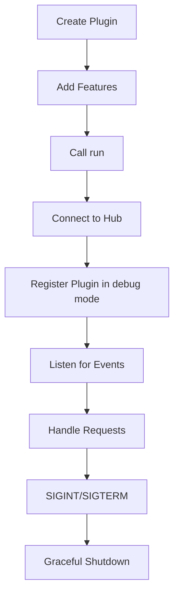

## Overview

The plugin instance is returned by the `createPlugin` function and provides methods to register features (credentials, tools, models) and start the plugin process.

## Methods

### addCredential

Adds a new credential definition to the plugin registry.

```typescript
addCredential(credential: CredentialDefinition): void
```

#### Parameters

<ParamField path="credential" type="CredentialDefinition" required>
  The credential definition to register
  
  <Expandable title="properties">
    <ParamField path="name" type="string" required>
      Unique name for the credential
    </ParamField>
    
    <ParamField path="description" type="string" required>
      Description of what the credential is used for
    </ParamField>
    
    <ParamField path="fields" type="object" required>
      Schema defining the credential fields
    </ParamField>
    
    <ParamField path="authenticate" type="(args: { credential: Record<string, any>, extra: Record<string, any> }) => Promise<any>">
      Optional authentication method to validate credentials
    </ParamField>
  </Expandable>
</ParamField>

#### Throws

- Validation error if the credential definition does not match the schema

#### Example

```typescript
plugin.addCredential({
  name: 'api-key',
  description: 'API key for service authentication',
  fields: {
    apiKey: { type: 'string', required: true, secret: true }
  },
  authenticate: async ({ credential, extra }) => {
    // Validate the API key
    const isValid = await validateApiKey(credential.apiKey)
    return { valid: isValid }
  }
})
```

---

### addTool

Adds a new tool definition to the plugin registry.

```typescript
addTool(tool: ToolDefinition): void
```

#### Parameters

<ParamField path="tool" type="ToolDefinition" required>
  The tool definition to register
  
  <Expandable title="properties">
    <ParamField path="name" type="string" required>
      Unique name for the tool
    </ParamField>
    
    <ParamField path="description" type="string" required>
      Description of what the tool does
    </ParamField>
    
    <ParamField path="parameters" type="object" required>
      Schema defining the tool's input parameters
    </ParamField>
    
    <ParamField path="invoke" type="(args: { credentials?: Record<string, any>, parameters: Record<string, any> }) => Promise<any>" required>
      The function that executes the tool's logic
    </ParamField>
  </Expandable>
</ParamField>

#### Throws

- Validation error if the tool definition does not match the schema

#### Example

```typescript
plugin.addTool({
  name: 'search',
  description: 'Search for items in the database',
  parameters: {
    query: { type: 'string', required: true },
    limit: { type: 'number', default: 10 }
  },
  invoke: async ({ credentials, parameters }) => {
    const results = await searchDatabase(parameters.query, parameters.limit)
    return { results }
  }
})
```

---

### addModel

Adds a new model definition to the plugin registry.

```typescript
addModel(model: ModelDefinition): void
```

#### Parameters

<ParamField path="model" type="ModelDefinition" required>
  The model definition to register
  
  <Expandable title="properties">
    <ParamField path="name" type="string" required>
      Unique name for the model
    </ParamField>
    
    <ParamField path="description" type="string" required>
      Description of what the model does
    </ParamField>
  </Expandable>
</ParamField>

#### Throws

- Validation error if the model definition does not match the schema

#### Example

```typescript
plugin.addModel({
  name: 'gpt-4',
  description: 'OpenAI GPT-4 language model'
})
```

---

### run

Starts the plugin's main process. This method:
1. Establishes a connection to the Hub Server via the transporter
2. Registers the plugin (in debug mode)
3. Sets up event listeners for credential authentication and tool invocation
4. Configures signal handlers for graceful shutdown on SIGINT and SIGTERM

```typescript
run(): Promise<void>
```

#### Returns

<ResponseField name="void" type="Promise<void>">
  Promise that resolves when the plugin has started successfully
</ResponseField>

#### Example

```typescript
const plugin = await createPlugin({
  name: 'my-plugin',
  description: 'My awesome plugin'
})

// Register features
plugin.addTool(myTool)
plugin.addCredential(myCredential)

// Start the plugin
await plugin.run()
console.log('Plugin is now running!')
```

## Event Handling

When `run()` is called, the plugin automatically handles these events from the Hub:

### credential_auth_spec

Triggered when a credential needs to be authenticated. The plugin:
1. Parses the incoming message with credential data
2. Resolves the credential definition from the registry
3. Executes the `authenticate` method if defined
4. Sends back `credential_auth_spec_response` or `credential_auth_spec_error`

### invoke_tool

Triggered when a tool should be executed. The plugin:
1. Parses the incoming message with tool name and parameters
2. Resolves the tool definition from the registry
3. Executes the `invoke` method with provided parameters and credentials
4. Sends back `invoke_tool_response` or `invoke_tool_error`

## Lifecycle


