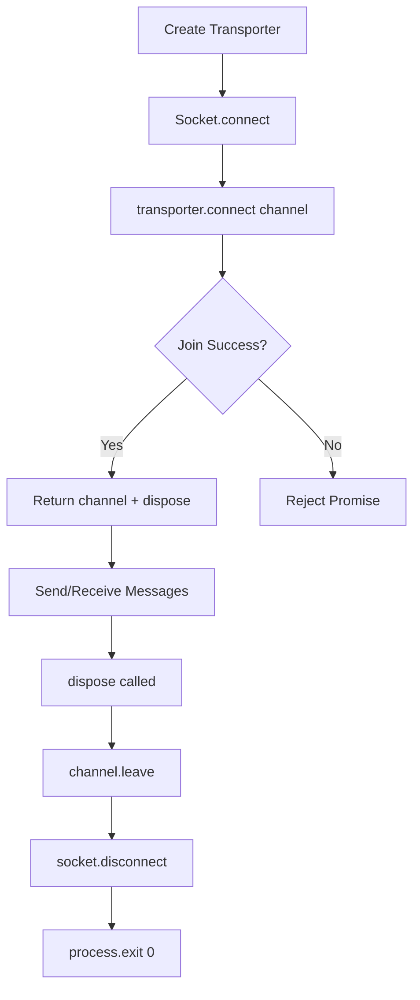

## Overview

The Transporter provides WebSocket-based communication between plugins and the Atomemo Hub Server using the Phoenix Channels protocol. It handles connection management, message passing, and error handling.

<Note>
The Transporter is an internal component created automatically by `createPlugin()`. Plugin developers typically don't need to interact with it directly, as the SDK handles all communication automatically.
</Note>

## Function Signature

```typescript
function createTransporter(
  options?: TransporterOptions
): Transporter
```

## Parameters

<ParamField path="options" type="TransporterOptions">
  Optional configuration for the transporter
  
  <Expandable title="properties">
    <ParamField path="heartbeatIntervalMs" type="number">
      Interval in milliseconds for sending heartbeat messages to keep the connection alive. Defaults to `30000` (30 seconds)
    </ParamField>
    
    <ParamField path="onOpen" type="() => void">
      Callback function invoked when the WebSocket connection is successfully opened
    </ParamField>
    
    <ParamField path="onClose" type="(event: CloseEvent) => void">
      Callback function invoked when the WebSocket connection is closed
    </ParamField>
    
    <ParamField path="onError" type="(error: Error, transport: string, establishedConnections: number) => void">
      Callback function invoked when a WebSocket error occurs. Special handling is provided for authentication failures.
    </ParamField>
    
    <ParamField path="onMessage" type="(message: any) => void">
      Callback function invoked when any message is received from the server
    </ParamField>
  </Expandable>
</ParamField>

## Returns

<ResponseField name="transporter" type="object">
  An object with a connect method to establish channel connections
  
  <Expandable title="methods">
    <ResponseField name="connect" type="(channelName: string) => Promise<{ channel: Channel; dispose: () => void }>">
      Connects to the specified channel and returns a channel object and dispose function
    </ResponseField>
  </Expandable>
</ResponseField>

## Methods

### connect

Connects to a specific channel on the WebSocket and returns the channel instance along with a cleanup function.

```typescript
connect(channelName: string): Promise<{
  channel: Channel
  dispose: () => void
}>
```

#### Parameters

<ParamField path="channelName" type="string" required>
  The name of the channel to join (e.g., `"debug_plugin:my-plugin"` or `"release_plugin:my-plugin__production__1.0.0"`)
</ParamField>

#### Returns

<ResponseField name="result" type="object">
  An object containing the channel and a dispose function
  
  <Expandable title="properties">
    <ResponseField name="channel" type="Channel">
      The Phoenix Channel instance for sending and receiving messages
      
      <Expandable title="methods">
        <ResponseField name="push" type="(event: string, payload: any) => void">
          Sends a message to the channel
        </ResponseField>
        
        <ResponseField name="on" type="(event: string, callback: (message: any) => void) => void">
          Registers a listener for channel events
        </ResponseField>
        
        <ResponseField name="leave" type="() => void">
          Leaves the channel
        </ResponseField>
      </Expandable>
    </ResponseField>
    
    <ResponseField name="dispose" type="() => void">
      Function to gracefully disconnect from the channel and socket, then exit the process
    </ResponseField>
  </Expandable>
</ResponseField>

#### Throws

- Error if the channel join fails
- Error if the channel join times out

## Example Usage

<Note>
The Transporter is created internally by the SDK. The examples below show the internal implementation for reference. Plugin developers should use `createPlugin()` which handles transporter creation automatically.
</Note>

### Internal Implementation

The transporter is created internally when you call `createPlugin()`:

```typescript
import { createPlugin } from '@choiceopen/atomemo-plugin-sdk-js'

const plugin = await createPlugin({
  name: 'my-plugin',
  display_name: { en_US: 'My Plugin' },
  description: { en_US: 'My plugin description' },
  // The SDK creates and manages the transporter automatically
  transporterOptions: {
    heartbeatIntervalMs: 30000,
    onOpen: () => console.log('Connection established'),
    onClose: () => console.log('Connection closed')
  }
})

// Run the plugin (internally connects via transporter)
await plugin.run()
```

### Custom Connection Handlers

You can configure connection handlers via `transporterOptions`:

```typescript
import { createPlugin } from '@choiceopen/atomemo-plugin-sdk-js'

const plugin = await createPlugin({
  name: 'my-plugin',
  display_name: { en_US: 'My Plugin' },
  description: { en_US: 'My plugin description' },
  transporterOptions: {
    heartbeatIntervalMs: 60000,
    onOpen: () => {
      console.log('Connected to Atomemo Hub')
    },
    onMessage: (message) => {
      console.log('Message received:', JSON.stringify(message, null, 2))
    },
    onError: (error, transport, connections) => {
      console.error(`Error on ${transport} (${connections} connections):`, error)
    }
  }
})

await plugin.run()
```

## Connection URL

The transporter automatically constructs the WebSocket URL based on environment variables:

```typescript
const url = `${HUB_WS_URL}/${HUB_MODE}_socket`
```

- `HUB_WS_URL`: The base WebSocket URL for the Hub Server
- `HUB_MODE`: Either `"debug"` or a release environment name

## Authentication

In non-production environments, the transporter automatically includes the debug API key in the connection parameters:

```typescript
params: { api_key: HUB_DEBUG_API_KEY }
```

### Authentication Errors

If authentication fails (status code is not 101), the transporter:
1. Logs an error message
2. In non-production mode, suggests running `atomemo plugin refresh-key`
3. Exits the process with code 1

## Logging

When the `DEBUG` environment variable is set, the transporter provides detailed logging:

```typescript
[timestamp] KIND message data
```

Examples:
- `[2026-03-01 12:00:00] CHANNEL:JOINED Joined debug_plugin:my-plugin successfully`
- `[2026-03-01 12:00:05] CHANNEL:ERROR Failed to join debug_plugin:my-plugin`

## Lifecycle



## Error Handling

The transporter handles several error scenarios:

### Connection Failures

```typescript
channel.join()
  .receive('error', (response) => {
    // Logs: Failed to join {channelName}
    // Rejects with Error
  })
```

### Timeouts

```typescript
channel.join()
  .receive('timeout', (response) => {
    // Logs: Timeout while joining {channelName}
    // Rejects with Error
  })
```

### Socket Errors

Special handling for 101 status code errors (authentication failures) exits the process and suggests refreshing the API key.
