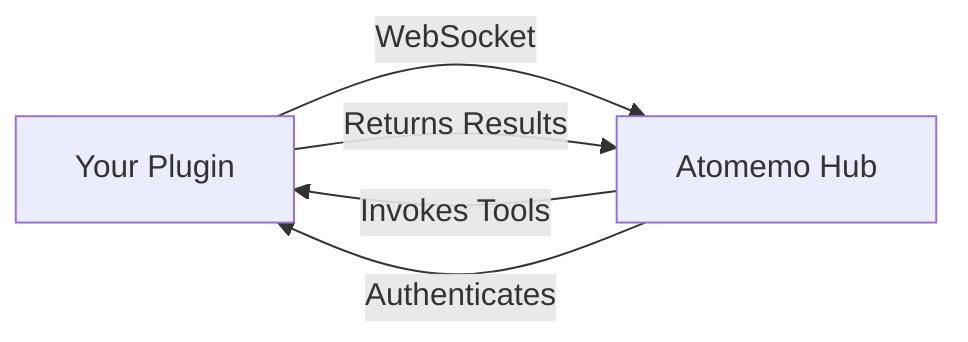

## Welcome to Atomemo Plugin SDK

The **Atomemo Plugin SDK for JavaScript/TypeScript** enables you to extend Choiceform Atomemo with custom tools, credentials, and AI models. Build plugins that integrate with external APIs, add new capabilities to AI agents, and create custom workflows.

<CardGroup cols={2}>
  <Card title="Quick Start" icon="rocket" href="/quickstart">
    Get your first plugin running in minutes
  </Card>
  <Card title="Installation" icon="download" href="/installation">
    Install the SDK and set up your environment
  </Card>
  <Card title="API Reference" icon="code" href="/api/create-plugin">
    Explore the complete SDK API
  </Card>
  <Card title="Examples" icon="lightbulb" href="/examples/basic-plugin">
    Learn from real-world plugin examples
  </Card>
</CardGroup>

## What You Can Build

The Atomemo Plugin SDK allows you to create three types of features:

### Tools

Extend AI agents with custom actions and capabilities. Tools can:
- Call external APIs and services
- Process and transform data
- Perform complex operations
- Integrate with third-party platforms

```typescript
plugin.addTool({
  name: "send-email",
  display_name: { en_US: "Send Email" },
  description: { en_US: "Send an email via SMTP" },
  icon: "📧",
  parameters: [
    { name: "to", type: "string", required: true },
    { name: "subject", type: "string", required: true },
    { name: "body", type: "string", required: true }
  ],
  invoke: async ({ args }) => {
    // Your tool implementation
    return { success: true }
  }
})
```

### Credentials

Manage authentication for external services securely:
- OAuth flows
- API keys
- Custom authentication methods
- Token validation

```typescript
plugin.addCredential({
  name: "api-key",
  display_name: { en_US: "API Key" },
  description: { en_US: "Authenticate with an API key" },
  icon: "🔑",
  parameters: [
    { name: "api_key", type: "string", required: true, secret: true }
  ],
  authenticate: async ({ args }) => {
    // Validate credentials
    return { valid: true }
  }
})
```

### Models

Integrate custom AI models and providers:
- LLM integrations
- Vision models
- Speech models
- Custom model endpoints

```typescript
plugin.addModel({
  name: "custom-provider/gpt-4",
  display_name: { en_US: "GPT-4" },
  description: { en_US: "OpenAI GPT-4 model" },
  icon: "🤖",
  model_type: "llm",
  input_modalities: ["text"],
  output_modalities: ["text"],
  unsupported_parameters: []
})
```

## Key Features

<AccordionGroup>
  <Accordion title="Type-Safe Development" icon="shield">
    Built with TypeScript for full type safety and excellent IDE support. Catch errors at compile time and enjoy autocomplete for all SDK methods.
  </Accordion>

  <Accordion title="Hot Reload Development" icon="rotate">
    Debug mode enables rapid iteration with instant updates when you change your code. No need to restart your plugin during development.
  </Accordion>

  <Accordion title="Multi-Language Support" icon="globe">
    Built-in internationalization (i18n) support. Define display names and descriptions in multiple languages for global reach.
  </Accordion>

  <Accordion title="Schema Validation" icon="check">
    Automatic validation of plugin definitions using Zod schemas. Get clear error messages when something's not right.
  </Accordion>
</AccordionGroup>

## Architecture Overview

The SDK uses a WebSocket-based transport layer to communicate with Atomemo Hub:



<Note>
  The SDK handles all the low-level communication details, so you can focus on building your plugin's functionality.
</Note>

## Development Modes

The SDK supports two runtime modes:

| Mode | Purpose | Use Case |
|------|---------|----------|
| **Debug** | Local development with hot reload | Testing and iteration |
| **Release** | Production deployment | Published plugins |

Set the mode using the `HUB_MODE` environment variable:

```bash
# Debug mode (default)
HUB_MODE=debug bun run dev

# Release mode
HUB_MODE=release bun start
```

## Version Information

<Info>
  **Current Version:** 0.3.2  
  **License:** MIT  
  **Runtime:** Bun (recommended) or Node.js 18+
</Info>

## Next Steps

<Steps>
  <Step title="Install the SDK">
    Follow the [installation guide](/installation) to set up your development environment.
  </Step>
  
  <Step title="Build Your First Plugin">
    Complete the [quickstart tutorial](/quickstart) to create a working plugin in minutes.
  </Step>
  
  <Step title="Explore Examples">
    Check out real-world examples to learn best practices and advanced patterns.
  </Step>
</Steps>

## Getting Help

Need assistance? Here's how to get support:

- **GitHub Issues:** [Report bugs or request features](https://github.com/choice-open/atomemo-plugin-sdk-js/issues)
- **Documentation:** Browse the complete API reference and guides
- **Community:** Join other plugin developers in our community forums

<Warning>
  This SDK requires Bun runtime for optimal performance. While Node.js is supported, some features may require additional configuration.
</Warning>