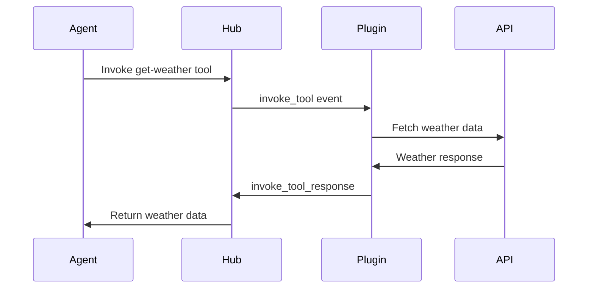

## Overview

This guide will walk you through creating a functional Atomemo plugin that adds a weather lookup tool. You'll learn the core concepts of the SDK and have a working plugin by the end.

<Info>
  **Prerequisites:** Complete the [installation guide](/installation) before starting this tutorial.
</Info>

## What We'll Build

We'll create a plugin that:
- Adds a weather lookup tool
- Uses an API key credential for authentication
- Returns real weather data for any city
- Demonstrates proper error handling

## Step-by-Step Guide

<Steps>
  <Step title="Create the plugin instance">
    Start by importing the SDK and creating a plugin instance with basic metadata:

    ```typescript src/index.ts
    import { createPlugin } from "@choiceopen/atomemo-plugin-sdk-js"

    const plugin = await createPlugin({
      name: "weather-plugin",
      display_name: { en_US: "Weather Plugin" },
      description: { en_US: "Get current weather information for any city" },
      icon: "☁️",
      locales: ["en_US"],
      transporterOptions: {
        // Optional: configure WebSocket connection
      }
    })
    ```

    <Note>
      The `createPlugin` function is async because it fetches user session data in debug mode.
    </Note>
  </Step>

  <Step title="Add a credential for API authentication">
    Define a credential to securely store the weather API key:

    ```typescript
    plugin.addCredential({
      name: "weather-api-key",
      display_name: { en_US: "Weather API Key" },
      description: { en_US: "API key from OpenWeatherMap" },
      icon: "🔑",
      parameters: [
        {
          name: "api_key",
          type: "string",
          description: { en_US: "Your OpenWeatherMap API key" },
          required: true,
          secret: true
        }
      ],
      authenticate: async ({ args }) => {
        const { credential } = args
        const apiKey = credential.api_key

        // Validate the API key by making a test request
        const response = await fetch(
          `https://api.openweathermap.org/data/2.5/weather?q=London&appid=${apiKey}`
        )

        if (!response.ok) {
          throw new Error("Invalid API key")
        }

        return {
          valid: true,
          message: "API key validated successfully"
        }
      }
    })
    ```

    <Warning>
      Always mark sensitive fields like API keys with `secret: true` to ensure they're properly encrypted.
    </Warning>
  </Step>

  <Step title="Add the weather lookup tool">
    Create a tool that uses the credential to fetch weather data:

    ```typescript
    plugin.addTool({
      name: "get-weather",
      display_name: { en_US: "Get Weather" },
      description: { en_US: "Get current weather information for a city" },
      icon: "🌤️",
      parameters: [
        {
          name: "city",
          type: "string",
          description: { en_US: "City name (e.g., 'London' or 'New York')" },
          required: true
        },
        {
          name: "units",
          type: "string",
          description: { en_US: "Temperature units: 'metric' (Celsius) or 'imperial' (Fahrenheit)" },
          required: false,
          default: "metric"
        }
      ],
      credentials: ["weather-api-key"],
      invoke: async ({ args }) => {
        const { parameters, credentials } = args
        const { city, units = "metric" } = parameters
        const apiKey = credentials?.["weather-api-key"]?.api_key

        if (!apiKey) {
          throw new Error("API key not provided")
        }

        try {
          // Fetch weather data from OpenWeatherMap API
          const response = await fetch(
            `https://api.openweathermap.org/data/2.5/weather?q=${encodeURIComponent(city)}&units=${units}&appid=${apiKey}`
          )

          if (!response.ok) {
            if (response.status === 404) {
              throw new Error(`City "${city}" not found`)
            }
            throw new Error(`Weather API error: ${response.statusText}`)
          }

          const data = await response.json()

          // Return formatted weather data
          return {
            success: true,
            data: {
              city: data.name,
              country: data.sys.country,
              temperature: data.main.temp,
              feels_like: data.main.feels_like,
              humidity: data.main.humidity,
              description: data.weather[0].description,
              wind_speed: data.wind.speed,
              units: units === "metric" ? "°C" : "°F"
            }
          }
        } catch (error) {
          return {
            success: false,
            error: error instanceof Error ? error.message : "Unknown error"
          }
        }
      }
    })
    ```

    <Tip>
      Tools receive credentials automatically when invoked. The SDK handles credential management for you.
    </Tip>
  </Step>

  <Step title="Start the plugin">
    Finally, start the plugin to connect to Atomemo Hub:

    ```typescript
    console.log("🚀 Starting Weather Plugin...")
    await plugin.run()
    console.log("✅ Plugin is running and ready to receive requests")
    ```

    The `run()` method:
    - Connects to the Hub via WebSocket
    - Registers your plugin (in debug mode)
    - Listens for tool invocations and credential authentication requests
    - Handles graceful shutdown on SIGINT/SIGTERM
  </Step>
</Steps>

## Complete Code

Here's the full plugin implementation:

<CodeGroup>
```typescript src/index.ts
import { createPlugin } from "@choiceopen/atomemo-plugin-sdk-js"

const plugin = await createPlugin({
  name: "weather-plugin",
  display_name: { en_US: "Weather Plugin" },
  description: { en_US: "Get current weather information for any city" },
  icon: "☁️",
  locales: ["en_US"]
})

// Add API key credential
plugin.addCredential({
  name: "weather-api-key",
  display_name: { en_US: "Weather API Key" },
  description: { en_US: "API key from OpenWeatherMap" },
  icon: "🔑",
  parameters: [
    {
      name: "api_key",
      type: "string",
      description: { en_US: "Your OpenWeatherMap API key" },
      required: true,
      secret: true
    }
  ],
  authenticate: async ({ args }) => {
    const { credential } = args
    const apiKey = credential.api_key

    const response = await fetch(
      `https://api.openweathermap.org/data/2.5/weather?q=London&appid=${apiKey}`
    )

    if (!response.ok) {
      throw new Error("Invalid API key")
    }

    return {
      valid: true,
      message: "API key validated successfully"
    }
  }
})

// Add weather lookup tool
plugin.addTool({
  name: "get-weather",
  display_name: { en_US: "Get Weather" },
  description: { en_US: "Get current weather information for a city" },
  icon: "🌤️",
  parameters: [
    {
      name: "city",
      type: "string",
      description: { en_US: "City name" },
      required: true
    },
    {
      name: "units",
      type: "string",
      description: { en_US: "Temperature units" },
      required: false,
      default: "metric"
    }
  ],
  credentials: ["weather-api-key"],
  invoke: async ({ args }) => {
    const { parameters, credentials } = args
    const { city, units = "metric" } = parameters
    const apiKey = credentials?.["weather-api-key"]?.api_key

    if (!apiKey) {
      throw new Error("API key not provided")
    }

    try {
      const response = await fetch(
        `https://api.openweathermap.org/data/2.5/weather?q=${encodeURIComponent(city)}&units=${units}&appid=${apiKey}`
      )

      if (!response.ok) {
        if (response.status === 404) {
          throw new Error(`City "${city}" not found`)
        }
        throw new Error(`Weather API error: ${response.statusText}`)
      }

      const data = await response.json()

      return {
        success: true,
        data: {
          city: data.name,
          country: data.sys.country,
          temperature: data.main.temp,
          feels_like: data.main.feels_like,
          humidity: data.main.humidity,
          description: data.weather[0].description,
          wind_speed: data.wind.speed,
          units: units === "metric" ? "°C" : "°F"
        }
      }
    } catch (error) {
      return {
        success: false,
        error: error instanceof Error ? error.message : "Unknown error"
      }
    }
  }
})

// Start the plugin
console.log("🚀 Starting Weather Plugin...")
await plugin.run()
console.log("✅ Plugin is running and ready to receive requests")
```

```env .env
# OpenWeatherMap API (get yours at https://openweathermap.org/api)
OPENWEATHER_API_KEY=your_api_key_here

# Hub Configuration
HUB_WS_URL=wss://hub.atomemo.ai/socket
HUB_DEBUG_API_KEY=your_debug_api_key
HUB_MODE=debug

# Development Settings
NODE_ENV=development
DEBUG=true
```
</CodeGroup>

## Run Your Plugin

Start the plugin in development mode:

```bash
bun run dev
```

You should see output like:

```
🚀 Starting Weather Plugin...
✅ Plugin is running and ready to receive requests
```

<Check>
  Your plugin is now running and connected to Atomemo Hub! It will automatically register in debug mode.
</Check>

## Test Your Plugin

In debug mode, the SDK automatically saves your plugin definition to `definition.json`. You can inspect this file to see how your plugin is registered:

```bash
cat definition.json
```

<Accordion title="View example definition.json">
  ```json
  {
    "name": "weather-plugin",
    "display_name": {
      "en_US": "Weather Plugin"
    },
    "description": {
      "en_US": "Get current weather information for any city"
    },
    "icon": "☁️",
    "locales": ["en_US"],
    "author": "Your Name",
    "email": "your.email@example.com",
    "version": "0.1.0",
    "credentials": [
      {
        "name": "weather-api-key",
        "display_name": {
          "en_US": "Weather API Key"
        },
        "parameters": [...]
      }
    ],
    "tools": [
      {
        "name": "get-weather",
        "display_name": {
          "en_US": "Get Weather"
        },
        "parameters": [...]
      }
    ]
  }
  ```
</Accordion>

## Key Concepts Learned

<CardGroup cols={2}>
  <Card title="Plugin Initialization" icon="plug">
    Use `createPlugin()` to initialize your plugin with metadata and configuration.
  </Card>
  
  <Card title="Credentials" icon="key">
    Add credentials with `addCredential()` to manage authentication for external services.
  </Card>
  
  <Card title="Tools" icon="wrench">
    Define tools with `addTool()` to add capabilities that AI agents can invoke.
  </Card>
  
  <Card title="Lifecycle" icon="rotate">
    Use `run()` to start the plugin and connect to Atomemo Hub.
  </Card>
</CardGroup>

## Understanding Tool Invocation

When an AI agent invokes your tool, the flow looks like this:



## Adding Internationalization

Extend your plugin to support multiple languages:

```typescript
const plugin = await createPlugin({
  name: "weather-plugin",
  display_name: {
    en_US: "Weather Plugin",
    es_ES: "Plugin de Clima",
    fr_FR: "Plugin Météo"
  },
  description: {
    en_US: "Get current weather information for any city",
    es_ES: "Obtén información meteorológica actual de cualquier ciudad",
    fr_FR: "Obtenez les informations météorologiques actuelles pour n'importe quelle ville"
  },
  icon: "☁️",
  locales: ["en_US", "es_ES", "fr_FR"]
})
```

<Tip>
  All display names and descriptions support localization. Add translations for all your supported locales.
</Tip>

## Adding Models (Optional)

You can also integrate AI models into your plugin:

```typescript
plugin.addModel({
  name: "openai/gpt-4",
  display_name: { en_US: "GPT-4" },
  description: { en_US: "OpenAI's GPT-4 language model" },
  icon: "🤖",
  model_type: "llm",
  input_modalities: ["text"],
  output_modalities: ["text"],
  unsupported_parameters: []
})
```

## Error Handling Best Practices

<AccordionGroup>
  <Accordion title="Tool Invocation Errors">
    Always wrap tool logic in try-catch blocks:
    
    ```typescript
    invoke: async ({ args }) => {
      try {
        // Your tool logic
        return { success: true, data: result }
      } catch (error) {
        return {
          success: false,
          error: error instanceof Error ? error.message : "Unknown error"
        }
      }
    }
    ```
  </Accordion>

  <Accordion title="Credential Validation">
    Throw descriptive errors when authentication fails:
    
    ```typescript
    authenticate: async ({ args }) => {
      if (!isValidKey(args.credential.api_key)) {
        throw new Error("Invalid API key format")
      }
      // Validation logic...
    }
    ```
  </Accordion>

  <Accordion title="Parameter Validation">
    Validate parameters before processing:
    
    ```typescript
    const { city } = parameters
    if (!city || typeof city !== "string") {
      throw new Error("City parameter is required and must be a string")
    }
    ```
  </Accordion>
</AccordionGroup>

## Next Steps

<Steps>
  <Step title="Explore Advanced Features">
    Learn about advanced SDK features like custom transporter options and model integrations.
  </Step>
  
  <Step title="Deploy Your Plugin">
    Switch to release mode and deploy your plugin to production.
  </Step>
  
  <Step title="Browse Examples">
    Check out more complex examples in the examples section.
  </Step>
</Steps>

## Common Issues

<Warning>
  **WebSocket Connection Failed**  
  Ensure `HUB_WS_URL` is correctly set and points to a running Atomemo Hub instance.
</Warning>

<Warning>
  **Credential Not Found**  
  Make sure the credential name in your tool's `credentials` array matches the credential you added with `addCredential()`.
</Warning>

<Warning>
  **Type Errors**  
  Run `bun run typecheck` to identify TypeScript issues. Ensure all required fields are provided.
</Warning>

## Getting Help

Need assistance?

- Check the [API Reference](/api/create-plugin) for detailed documentation
- Browse [Examples](/examples/basic-plugin) for more use cases
- Report issues on [GitHub](https://github.com/choice-open/atomemo-plugin-sdk-js/issues)

<Check>
  Congratulations! You've built your first Atomemo plugin. Continue exploring the SDK to unlock more powerful features.
</Check>